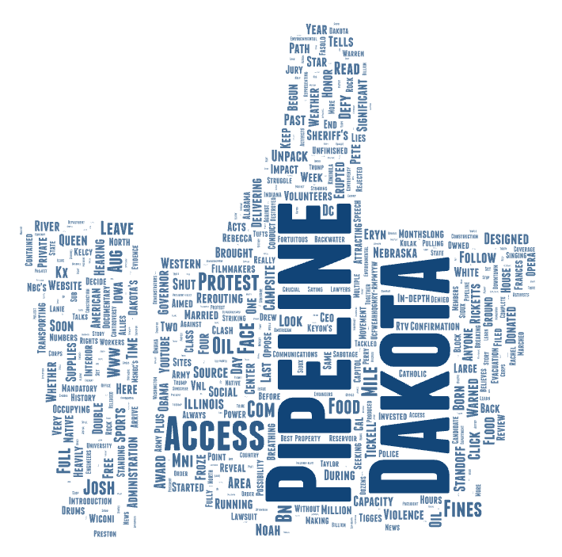

# Lab 2: YouTube Web Data Collection and Visualization

## Topic and Search Parameters
This project explores how YouTube content frames the topic of Standing Rock and the Dakota Access Pipeline.  
Data was collected using a Selenium-based web crawler on Google Colab.

The following search terms were used:
- "Standing Rock"
- "Dakota Access Pipeline"

Each search collected video metadata including video URLs, channel information, titles, and short descriptions.

## Why This Comparison
I chose this comparison to investigate how different keywords related to the same geographic issue produce different narratives on YouTube. While both searches are for the same events, the language may impact whether the content emphasizes Indigenous resistance or legal and infrastructure viewpoints.

## Word Cloud Comparison
### Standing Rock

The Standing Rock word cloud emphasizes terms related to Indigenous identity, water protection, and protest, such as “water protectors,” “Mni Wiconi,” and “Oceti Sakowin.”

### Dakota Access Pipeline

This word cloud highlights terms related to infrastructure, law, and governance, including “pipeline,” “access,” “court,” and “oil.”

## Observed Patterns
The differences suggest that search language strongly shapes how geographic and political issues are represented online. The Standing Rock framing centers people and place, while the pipeline framing centers legality and development.

## Limitations and Future Improvements
This research could be improved by:
- Collecting data over multiple time periods
- Including additional search terms
- Applying automated text cleaning before word cloud generation

## Unexpected Findings
I was surprised by how strongly the pipeline search emphasized legal and enforcement language compared to the community-centered language of the Standing Rock search.

## Data Downloads

- [Standing Rock CSV](./assets/search-results-uw.csv)
- [Dakota Access Pipeline CSV](./assets/search-results-uw%20(1).csv)

